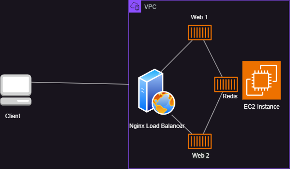
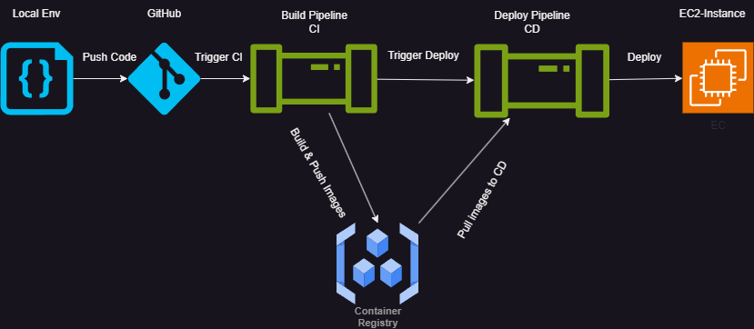
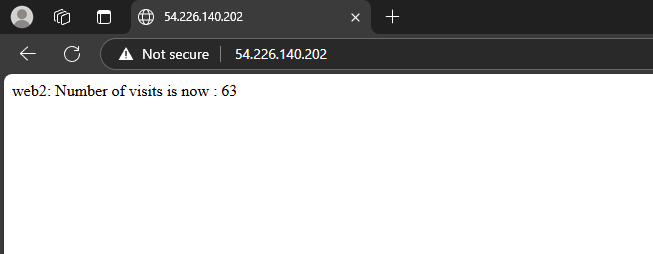
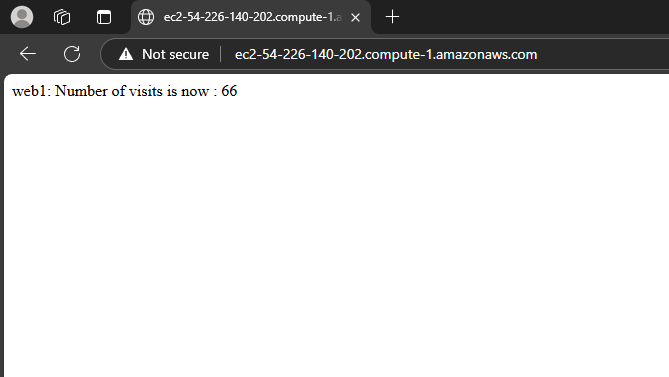

## Node.js application with Nginx proxy and Redis database to demonstrate GitHub CI/CD workflow

### Project structure:
```
.
├── README.md
├── images
├── docker-compose.yaml
├── nginx
│   ├── Dockerfile
│   └── nginx.conf
└── web
    ├── Dockerfile
    ├── package.json
    └── server.js

```
## Architecture Diagram:



## Clone and push to your github
```
git clone https://github.com/surendrababu2012/nginx-nodejs-redis.git

cd nginx-nodejs-redis

git add .

git commit -m "any message"

git push origin main

```
> ℹ️ **_INFO_**  
> You have to add env variables into your github repository. Go to Settings > Secrets and variables > Actions > New repository secrets
> Env variables(DOCKERHUB_TOKEN,DOCKERHUB_USERNAME,EC2_HOST,EC2_KEY,EC2_USER)
> Create a Docker Hub personal access token by going into hub.docker.com.


The compose file defines an application with four services `redis`, `nginx`, `web1` and `web2`.
When deploying the application, docker compose maps port 80 of the nginx service container to port 80 of the host as specified in the file.


> ℹ️ **_INFO_**  
> Redis runs on port 6379 by default. Make sure port 6379 on the host is not being used by another container, otherwise the port should be changed.

## Create a EC2 instance in AWS

> Go to AWS management console and create a EC2 instance in a public subnet, while creating instance provide the userdata as below to bootstrap the docker compose and make sure to select ubuntu distro(Latest is preffered). 


```
# Add ubuntu user to sudo group

usermod -aG sudo ubuntu

# Add Docker's official GPG key:

sudo apt-get update
sudo apt-get install ca-certificates curl
sudo install -m 0755 -d /etc/apt/keyrings
sudo curl -fsSL https://download.docker.com/linux/ubuntu/gpg -o /etc/apt/keyrings/docker.asc
sudo chmod a+r /etc/apt/keyrings/docker.asc

# Add the repository to Apt sources:

echo \
  "deb [arch=$(dpkg --print-architecture) signed-by=/etc/apt/keyrings/docker.asc] https://download.docker.com/linux/ubuntu \
  $(. /etc/os-release && echo "${UBUNTU_CODENAME:-$VERSION_CODENAME}") stable" | \
  sudo tee /etc/apt/sources.list.d/docker.list > /dev/null
sudo apt-get update

sudo apt-get install docker-ce docker-ce-cli containerd.io docker-buildx-plugin docker-compose-plugin

sudo service docker start

```


Source : [Docker Docs](https://docs.docker.com/engine/install/ubuntu/#install-using-the-repository)

> Note: Security group must allow inbound traffic from ports 80,443,6379 and 22. Add rule accrodingly

## 

> You should able to find the hostname(EC2_HOST), username (EC2_USER=ubuntu). Don't forget to create a SSH key while EC2 creation, we then use it as EC2_KEY. 

##

> Now you have 1. Cloned GitHub 2. Docker Hub registry created 3. Env variables created


## Pipelines 




### Build CI Pipeline
```
This Pipeline will build the docker images and push to Docker Hub

```
### Deploy CD Pipeline

```
This Pipeline will pull images from docker hub and deploy to EC2 instance
```

##

> Deploy pipeline will authenticate to EC2 instance using SSH key and we do it by injecting keys into GitHub runner while pipeline runtime.

## Testing the app

To start the application you should have the above things setup and after first commit the pipelines should trigger. Now navigate to `http://EC2-DNSNAME:80` or `http://EC2-PUBLICIP:80`in your web browser or inside of ec2 instance run:

```
curl localhost:80
curl localhost:80
web1: Total number of visits is: 1
```

```
curl localhost:80
web1: Total number of visits is: 2
```
```
$ curl localhost:80
web2: Total number of visits is: 3
```






> Stop and teardown the EC2 instance.

## Issues

>If you stop the ec2 instance you have to update the env variable with new dns name as AWS will change the dns name for every stop-start unless you assign elastic IP and IP will not change or can use Route 53 to add custom DNS name, if owns ones.

## Referenced from below repository 

>[docker/awesome-compose](https://github.com/docker/awesome-compose)


